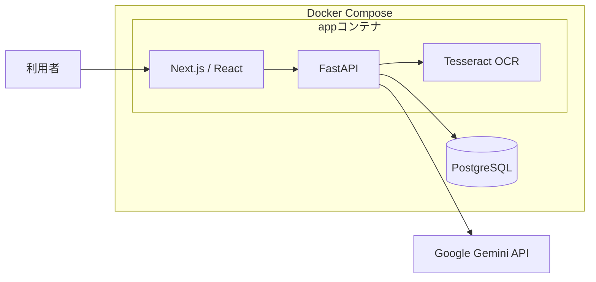
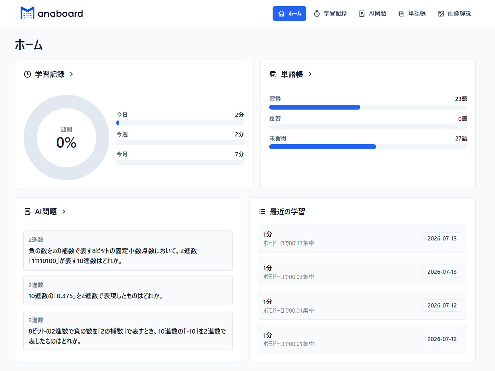
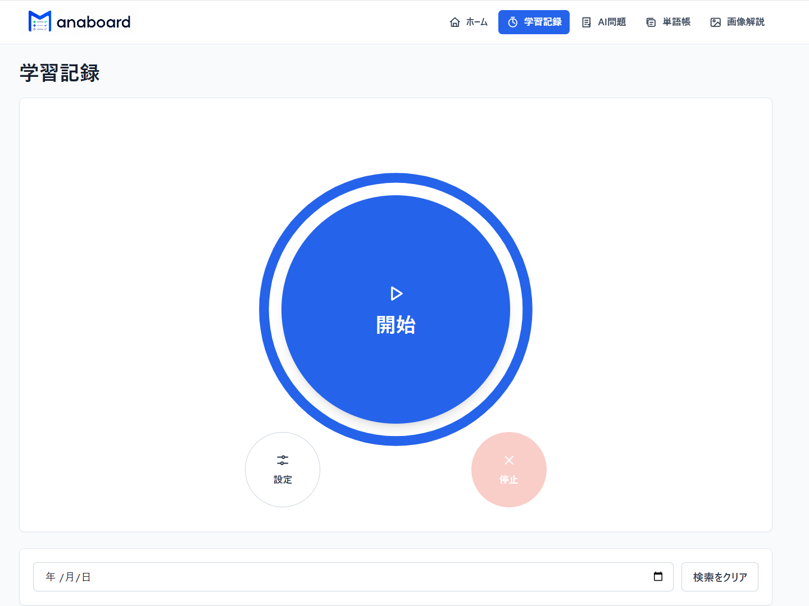
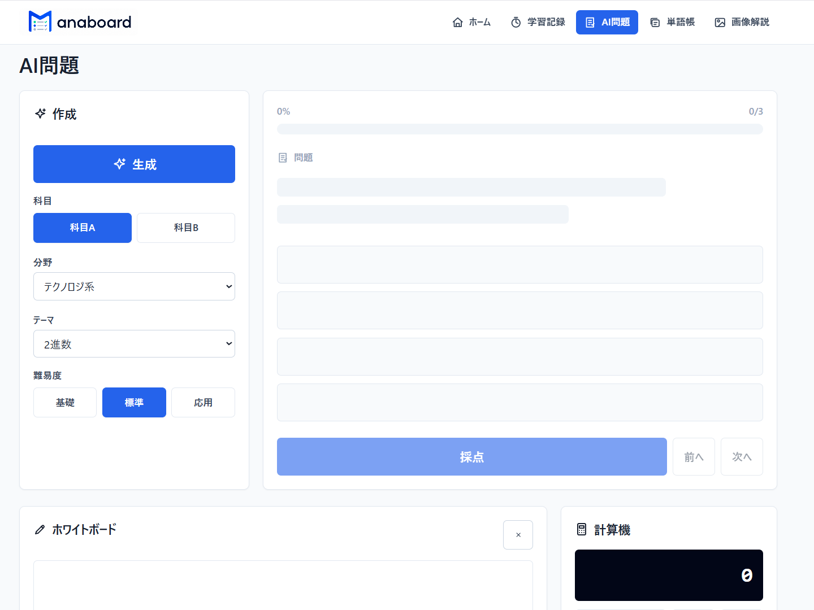
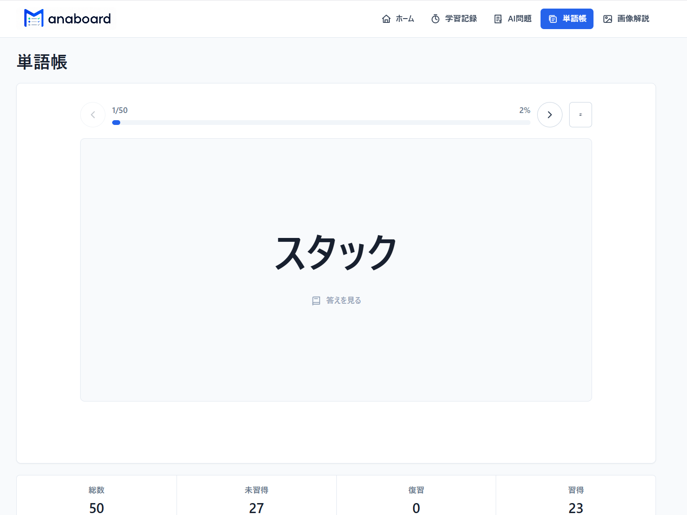
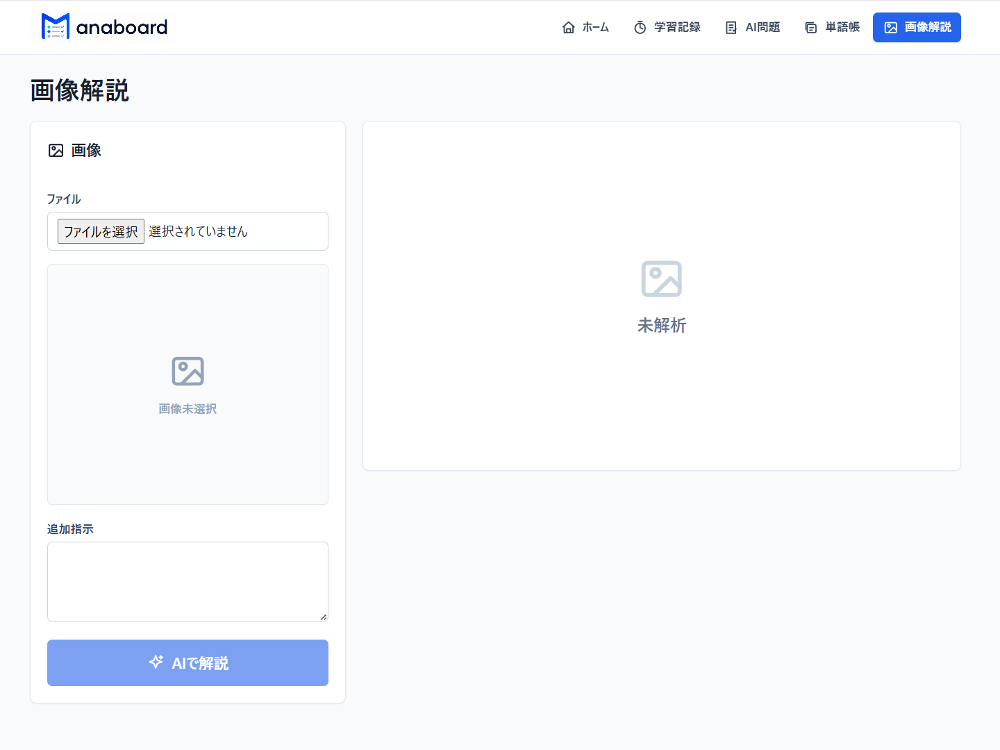

# Manaboard

Manaboardは、基本情報技術者試験の学習に特化した学習支援アプリです。
学習時間の記録、AI問題演習、単語復習、教材画像の解説を一つのアプリで利用できます。

## 制作背景

基本情報技術者試験の学習で、使用する過去問サイトは、出題された問題を反復して試験傾向をつかむことに適しています。
ですが、過去問題を繰り返し解くことで正解を覚えてしまい、問題文や数値が変わったときに知識を応用できないことがありました。
そこでManaboardでは固定された問題群だけを繰り返すのではなく、科目・分野・難易度をもとにAIが問題を都度生成することで、
ユーザーが初めて見る問題にも対応できる理解力を身につけることを目指しました。
問題演習だけでなく、自分が学習中に感じた不便を解決することも制作の目的の1つです。

## 目的

- 過去問題の暗記だけでなく、知識を使って初見問題へ対応できるようにする
- 学習記録、問題演習、単語復習、画像解説を一つの環境にまとめる
- 自分が基本情報技術者試験を学習する中で感じた不便を解決する

## 利用者が目指すこと

- 基本情報技術者試験の合格に必要な学習を継続する
- AIが生成した問題を通して、暗記だけでなく知識を応用する力を身につける
- 自分の学習状況を把握し、次に取り組む内容を判断できるようにする

## システム設計

### システム構成



Next.jsのフロントエンドとFastAPIのバックエンドを一つの`app`コンテナで動かし、PostgreSQLを`db`コンテナとして分離しています。AI問題、単語生成、画像認識にはGemini APIを使用し、画像内の文字情報はTesseract OCRで補助的に取得します。

## 画面紹介

### ホーム



学習記録、AI問題、単語帳の状況を一目で確認しでき、各機能のタイトルから対象画面へ移動できます。

### 学習記録



ポモドーロタイマーを中心にした学習記録画面です。
集中時間の終了または停止時に学習時間を保存します。

### AI問題



科目A・科目B、分野、テーマ、難易度を選ぶと内容を考慮し生成AIで問題を生成します。
問題は採点後に答えと解説を確認できます。
画面下部には計算や整理に使えるホワイトボードと計算機も用意しています。

### 単語帳



各科目や分野の用語をAIで単語生成し、単語帳形式で復習できます。

### 画像解説



基本情報の問題画像をアップロードし、問題文、要点、答え、解き方を生成します。


## 改善を起こなった点

### 1. AI画像認識とOCRの使い分け

Tesseract OCRだけでは、文字の検出に特化していたため文章問題には強いのですが、図や問題全体の構造を把握するのは難しいため、
Geminiの画像認識を中心にし、Tesseract OCRの結果は補助情報としてAIへ渡す構成へと変更し、答えと解き方を整理できるようにしました。

### 2. 情報量と操作性を両立するUI改善

開発初期は、一画面に多くの設定や情報を配置したため、どこを操作すればよいか分かりにくい状態でした。
実際に各画面を使いながら、設定項目はアイコンやダイアログへまとめ、解答表示によるレイアウトのずれも抑えることで、操作中の視線移動を減らしました。


## 今後の改善点

### AIの生成品質

現在の最大の課題は、AIが生成する問題、答え、解説の品質が一定ではないことや、ハルシネーション問題等が挙げられます。
また、
誤った内容や不自然な選択肢が生成される可能性があるため、生成結果の自動検証、出題形式の厳格化、根拠となる情報との照合を追加したいと考えています。

### スマートフォン対応

現在はデスクトップでの利用を中心に調整しています。スマートフォンでもタイマー、問題演習、単語復習を快適に利用できるよう、ナビゲーション、文字サイズ、ボタン配置、ホワイトボードの操作性を改善します。

### データベース連携の強化

学習記録、AI問題、単語帳のデータをさらに連携し、間違えた分野の単語を自動で復習対象にする、苦手分野の問題を優先して生成するなど、学習結果が次の学習内容へ反映される仕組みを追加したいと考えています。

## 使用技術

- フロントエンド: Next.js、React、TypeScript、Tailwind CSS
- バックエンド: FastAPI、SQLAlchemy
- データベース: PostgreSQL
- AI: Google Gemini API
- OCR: Tesseract
- 実行環境: Docker Compose

## セットアップ

1. `.env.example`を複製して、プロジェクト直下に`.env`を作成します。
2. `.env`にGemini APIキーを設定します。

```env
GEMINI_API_KEY=ここにAPIキーを設定
GEMINI_MODEL=gemini-3.5-flash
```

3. プロジェクト直下で次のコマンドを実行します。

```bash
docker compose up -d --build
```

4. ブラウザで[http://localhost:3000](http://localhost:3000)を開きます。

## Docker構成

- `app`: Next.jsフロントエンドとFastAPIバックエンド
- `db`: PostgreSQLデータベース

## URL

- アプリ: [http://localhost:3000](http://localhost:3000)
- APIドキュメント: [http://localhost:8000/docs](http://localhost:8000/docs)

## 注意事項

- 対応画像形式はJPEG、PNG、WebPです。
- アップロードできる画像は5MBまでです。
